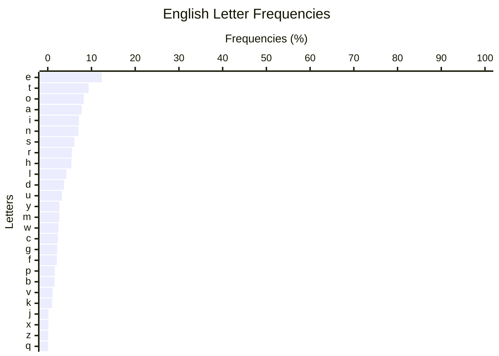

# **Chapter 3: English data (5 min)**

To understand where the stats for a layout are coming from, first we need to be familiar with the letter, bigram and trigram frequency of the language the layout is for. Most layouts were designed for English, so that is what we will be looking at.

Note: the bigram and trigram tables in the following sections were created using the [Monkeyracer corpus](../corpus/mr), using the scripts in the [Chapter 3 directory](../corpus/chapter3/).

## 3.1. English letter frequency

As one would expect, the vowels `E`, `O`, `A`, `I` are very frequent, while the most common consonants are `T`, `N`, `S`, `R`. These 8 would be the most important letters. Afterwards we would have the letter `H`, followed by `L`, `D`, and then the vowel `U`.

Note that the results will vary to some extent when using a different corpus. For example, on popular typing websites like TypeRacer or MonkeyType the letter H has around the same usage as R, while W and Y are on par with C.

## 3.2. Top 50 bigrams

**Two-letter sequences are known as `bigrams`.** The following is the top 50:

| 1-10  | freq  | 11-20 | freq  | 21-30 | freq  | 31-40 | freq  | 41-50 | freq  |
| ----- | ----- | ----- | ----- | ----- | ----- | ----- | ----- | ----- | ----- |
| th    | 3.89% | ha    | 1.36% | is    | 1.05% | le    | 0.84% | wh    | 0.61% |
| he    | 3.09% | ng    | 1.31% | me    | 1.03% | ne    | 0.82% | ho    | 0.60% |
| in    | 2.51% | to    | 1.23% | ar    | 1.01% | of    | 0.79% | om    | 0.60% |
| an    | 2.14% | en    | 1.23% | hi    | 0.93% | ti    | 0.78% | ro    | 0.60% |
| ou    | 1.98% | it    | 1.21% | ea    | 0.92% | as    | 0.76% | ow    | 0.60% |
| er    | 1.95% | ve    | 1.16% | se    | 0.88% | li    | 0.74% | de    | 0.60% |
| re    | 1.85% | or    | 1.16% | al    | 0.88% | be    | 0.73% | wa    | 0.59% |
| on    | 1.49% | yo    | 1.08% | ll    | 0.88% | no    | 0.72% | ut    | 0.58% |
| nd    | 1.49% | es    | 1.08% | te    | 0.87% | nt    | 0.69% | el    | 0.57% |
| at    | 1.39% | st    | 1.06% | ed    | 0.85% | ur    | 0.62% | co    | 0.56% |

We can see that **most bigrams involve a consonant + a vowel.** Having said that, there are some consonant-only bigrams that are very common (e.g. `TH`, `ND`, `ST`, `NT`, `NG`, `CH`, `LL`...). Lastly, the most relevant vowel-only bigrams are `OU`, `IO` and `EA`.

## 3.3. Top 50 trigrams

**Three-letter sequences are known as `trigrams`.** The following is the top 50:

| 1-10  | freq  | 11-20 | freq  | 21-30 | freq  | 31-40 | freq  | 41-50 | freq  |
| ----- | ----- | ----- | ----- | ----- | ----- | ----- | ----- | ----- | ----- |
| the   | 3.28% | all   | 0.54% | ter   | 0.39% | tio   | 0.32% | ers   | 0.27% |
| ing   | 1.53% | for   | 0.53% | rea   | 0.39% | ill   | 0.32% | ive   | 0.27% |
| you   | 1.50% | hin   | 0.53% | not   | 0.39% | but   | 0.32% | hav   | 0.27% |
| and   | 1.47% | eve   | 0.52% | are   | 0.38% | out   | 0.32% | ate   | 0.27% |
| hat   | 0.96% | our   | 0.50% | ght   | 0.35% | igh   | 0.31% | hey   | 0.26% |
| tha   | 0.79% | ome   | 0.44% | ave   | 0.35% | was   | 0.30% | nce   | 0.25% |
| her   | 0.72% | ion   | 0.42% | ith   | 0.34% | whe   | 0.29% | com   | 0.25% |
| thi   | 0.71% | ent   | 0.42% | now   | 0.33% | hen   | 0.29% | ess   | 0.25% |
| ere   | 0.59% | one   | 0.42% | ear   | 0.33% | can   | 0.28% | wor   | 0.25% |
| ver   | 0.57% | his   | 0.41% | wit   | 0.32% | oul   | 0.28% | uld   | 0.25% |

**Most trigrams involve both consonants and vowels.** In fact, vowel only trigrams are extremely rare. Although not seen on the table, some consonant-only trigrams are decently common, though (e.g. `LLY`, `STR`, `NGS`...).

## 3.4. Extended bigram tables

Over the following pages we look at bigram data in more detail. In order to make the information easier to digest, we will subdivide bigrams into different tables:

- [Vowel + vowel bigrams](#35-vowel--vowel-bigrams)
- [Consonant + consonant bigrams](#36-consonant--consonant-bigrams)
- [Consonant + vowel bigrams](#37-consonant--vowel-bigrams)
- [Double letters](#38-double-letters)

For a given table, bigrams will be sorted from most to least frequent. The number next to each bigram will indicate its frequency in percent (e.g. `OU` amounts to 0.870% of bigrams).

At the end of this chapter you will also find some additional data:

- [Consonant only trigrams](#39-consonant-only-trigrams)
- [Consonant only trigrams (excluding Y)](#310-consonant-only-trigrams-(excluding-Y))
- [Top words with apostrophe](#311-top-words-with-apostrophe)
- [Top trigrams with apostrophe](#312-top-trigrams-with-apostrophe)

## 3.5. Vowel + vowel bigrams

| 1-10  | freq  | 11-20 | freq  |
| ----- | ----- | ----- | ----- |
| ou    | 1.98% | oi    | 0.11% |
| ea    | 0.92% | ia    | 0.11% |
| ee    | 0.53% | ue    | 0.11% |
| io    | 0.36% | ui    | 0.09% |
| oo    | 0.35% | ua    | 0.07% |
| ie    | 0.32% | oe    | 0.06% |
| ai    | 0.32% | oa    | 0.05% |
| ei    | 0.15% | eu    | 0.01% |
| au    | 0.15% | iu    | 0.01% |
| eo    | 0.12% | uo    | 0.01% |

Vowel bigrams amount to 5.840% of bigrams.

## 3.6. Consonant + consonant bigrams

| 1-10  | freq  | 11-20 | freq  | 21-30 | freq  | 31-40 | freq  | 41-50 | freq  |
| ----- | ----- | ----- | ----- | ----- | ----- | ----- | ----- | ----- | ----- |
| th    | 3.89% | ld    | 0.38% | nc    | 0.26% | rd    | 0.18% | pp    | 0.13% |
| nd    | 1.49% | gh    | 0.36% | ct    | 0.25% | ty    | 0.17% | wn    | 0.12% |
| ng    | 1.31% | ns    | 0.34% | ht    | 0.25% | ds    | 0.16% | br    | 0.12% |
| st    | 1.06% | tr    | 0.34% | pr    | 0.25% | gr    | 0.15% | nk    | 0.12% |
| ll    | 0.88% | sh    | 0.32% | ts    | 0.24% | mp    | 0.15% | rl    | 0.12% |
| nt    | 0.69% | ry    | 0.31% | bl    | 0.21% | sp    | 0.15% | dr    | 0.12% |
| wh    | 0.61% | ss    | 0.30% | tt    | 0.20% | ny    | 0.15% | tl    | 0.11% |
| ch    | 0.44% | rt    | 0.29% | fr    | 0.20% | rn    | 0.14% | ls    | 0.11% |
| ly    | 0.40% | pl    | 0.26% | kn    | 0.20% | cr    | 0.13% | rr    | 0.11% |
| rs    | 0.39% | my    | 0.26% | ck    | 0.19% | ys    | 0.13% | ff    | 0.11% |

Consonant bigrams amount to 23.094% of bigrams.

## 3.7. Consonant + vowel bigrams

<table markdown='1'>
	<tr>
		<th>T + vowels</th>
		<th>N + vowels</th>
		<th>S + vowels</th>
		<th>R + vowels</th>
		<th>H + vowels</th>
		<th>L + vowels</th>
		<th>D + vowels</th>
		<th>Y + vowels</th>
		<th>M + vowels</th>
		<th>W + vowels</th>
		<th>C + vowels</th>
		<th>G + vowels</th>
		<th>F + vowels</th>
		<th>P + vowels</th>
		<th>B + vowels</th>
		<th>V + vowels</th>
		<th>K + vowels</th>
		<th>J + vowels</th>
		<th>X + vowels</th>
		<th>Z + vowels</th>
		<th>Q + vowels</th>
	</tr>
<tr><td markdown='1'>

| bigram | freq  |
| ------ | ----- |
| at     | 1.26% |
| to     | 1.11% |
| it     | 1.09% |
| te     | 0.79% |
| ti     | 0.70% |
| ut     | 0.52% |
| ot     | 0.47% |
| et     | 0.47% |
| ta     | 0.39% |
| tu     | 0.17% |

</td><td markdown='1'>

| bigram | freq  |
| ------ | ----- |
| in     | 2.27% |
| an     | 1.93% |
| on     | 1.34% |
| en     | 1.11% |
| ne     | 0.74% |
| no     | 0.65% |
| un     | 0.36% |
| ni     | 0.23% |
| na     | 0.19% |
| nu     | 0.04% |

</td><td markdown='1'>

| bigram | freq  |
| ------ | ----- |
| es     | 0.97% |
| is     | 0.94% |
| se     | 0.80% |
| as     | 0.68% |
| us     | 0.48% |
| so     | 0.46% |
| si     | 0.34% |
| os     | 0.24% |
| sa     | 0.22% |
| su     | 0.19% |

</td><td markdown='1'>

| bigram | freq  |
| ------ | ----- |
| er     | 1.76% |
| re     | 1.67% |
| or     | 1.04% |
| ar     | 0.91% |
| ur     | 0.56% |
| ro     | 0.54% |
| ri     | 0.49% |
| ra     | 0.38% |
| ir     | 0.25% |
| ru     | 0.13% |

</td><td markdown='1'>

| bigram | freq  |
| ------ | ----- |
| he     | 2.79% |
| ha     | 1.22% |
| hi     | 0.84% |
| ho     | 0.54% |
| hu     | 0.07% |
| eh     | 0.02% |
| oh     | 0.02% |
| ah     | 0.02% |
| uh     | 0.00% |
| ih     | 0.00% |

</td><td markdown='1'>

| bigram | freq  |
| ------ | ----- |
| al     | 0.79% |
| le     | 0.76% |
| li     | 0.67% |
| el     | 0.51% |
| lo     | 0.44% |
| il     | 0.42% |
| la     | 0.32% |
| ul     | 0.32% |
| ol     | 0.25% |
| lu     | 0.08% |

</td><td markdown='1'>

| bigram | freq  |
| ------ | ----- |
| ed     | 0.76% |
| de     | 0.54% |
| do     | 0.39% |
| ad     | 0.31% |
| di     | 0.30% |
| id     | 0.26% |
| od     | 0.18% |
| da     | 0.17% |
| du     | 0.05% |
| ud     | 0.05% |

</td><td markdown='1'>

| bigram | freq  |
| ------ | ----- |
| yo     | 0.98% |
| ay     | 0.37% |
| ey     | 0.23% |
| ye     | 0.11% |
| yi     | 0.05% |
| oy     | 0.04% |
| uy     | 0.02% |
| ya     | 0.01% |
| yu     | 0.00% |
| iy     | 0.00% |

</td><td markdown='1'>

| bigram | freq  |
| ------ | ----- |
| me     | 0.93% |
| om     | 0.54% |
| ma     | 0.49% |
| mo     | 0.31% |
| im     | 0.31% |
| em     | 0.30% |
| am     | 0.25% |
| mi     | 0.24% |
| um     | 0.10% |
| mu     | 0.10% |

</td><td markdown='1'>

| bigram | freq  |
| ------ | ----- |
| ow     | 0.54% |
| wa     | 0.53% |
| we     | 0.47% |
| wi     | 0.41% |
| wo     | 0.31% |
| ew     | 0.09% |
| aw     | 0.07% |
| wu     | 0.00% |
| iw     | 0.00% |
| uw     | 0.00% |

</td><td markdown='1'>

| bigram | freq  |
| ------ | ----- |
| co     | 0.50% |
| ca     | 0.49% |
| ce     | 0.43% |
| ac     | 0.35% |
| ic     | 0.34% |
| ec     | 0.30% |
| ci     | 0.14% |
| uc     | 0.12% |
| oc     | 0.08% |
| cu     | 0.08% |

</td><td markdown='1'>

| bigram | freq  |
| ------ | ----- |
| ge     | 0.34% |
| ig     | 0.27% |
| go     | 0.26% |
| ag     | 0.16% |
| ug     | 0.15% |
| gi     | 0.13% |
| ga     | 0.11% |
| gu     | 0.07% |
| eg     | 0.06% |
| og     | 0.06% |

</td><td markdown='1'>

| bigram | freq  |
| ------ | ----- |
| of     | 0.71% |
| fo     | 0.40% |
| if     | 0.29% |
| fe     | 0.29% |
| fi     | 0.23% |
| fa     | 0.17% |
| ef     | 0.11% |
| fu     | 0.09% |
| af     | 0.05% |
| uf     | 0.02% |

</td><td markdown='1'>

| bigram | freq  |
| ------ | ----- |
| pe     | 0.40% |
| pa     | 0.21% |
| po     | 0.21% |
| op     | 0.20% |
| ap     | 0.15% |
| up     | 0.14% |
| ep     | 0.12% |
| pi     | 0.11% |
| pu     | 0.07% |
| ip     | 0.05% |

</td><td markdown='1'>

| bigram | freq  |
| ------ | ----- |
| be     | 0.66% |
| bu     | 0.26% |
| bo     | 0.23% |
| ab     | 0.19% |
| ba     | 0.15% |
| bi     | 0.09% |
| ob     | 0.07% |
| ib     | 0.06% |
| ub     | 0.04% |
| eb     | 0.02% |

</td><td markdown='1'>

| bigram | freq  |
| ------ | ----- |
| ve     | 1.05% |
| ev     | 0.37% |
| av     | 0.26% |
| iv     | 0.22% |
| ov     | 0.18% |
| vi     | 0.16% |
| va     | 0.06% |
| vo     | 0.05% |
| vu     | 0.00% |
| uv     | 0.00% |

</td><td markdown='1'>

| bigram | freq  |
| ------ | ----- |
| ke     | 0.39% |
| ak     | 0.19% |
| ki     | 0.16% |
| ik     | 0.13% |
| ok     | 0.11% |
| ek     | 0.02% |
| ka     | 0.02% |
| ku     | 0.00% |
| ko     | 0.00% |
| uk     | 0.00% |

</td><td markdown='1'>

| bigram | freq  |
| ------ | ----- |
| ju     | 0.11% |
| jo     | 0.04% |
| je     | 0.02% |
| ja     | 0.01% |
| aj     | 0.01% |
| ej     | 0.00% |
| ji     | 0.00% |
| oj     | 0.00% |
| ij     | 0.00% |
| uj     | 0.00% |

</td><td markdown='1'>

| bigram | freq  |
| ------ | ----- |
| ex     | 0.12% |
| xi     | 0.03% |
| ix     | 0.02% |
| xa     | 0.01% |
| ax     | 0.01% |
| xe     | 0.01% |
| ox     | 0.01% |
| ux     | 0.00% |
| xu     | 0.00% |
| xo     | 0.00% |

</td><td markdown='1'>

| bigram | freq  |
| ------ | ----- |
| ze     | 0.04% |
| iz     | 0.04% |
| az     | 0.02% |
| za     | 0.01% |
| zi     | 0.01% |
| zo     | 0.01% |
| ez     | 0.01% |
| oz     | 0.00% |
| uz     | 0.00% |
| zu     | 0.00% |

</td><td markdown='1'>

| bigram | freq  |
| ------ | ----- |
| qu     | 0.08% |
| eq     | 0.02% |
| iq     | 0.00% |
| aq     | 0.00% |
| oq     | 0.00% |
| qi     | 0.00% |
| uq     | 0.00% |
| qa     | 0     |
| qe     | 0     |
| qo     | 0     |

</td></tr>
</table>

Consonant + vowel bigrams amount to about 64.085% of bigrams.

## 3.8. Double letters

| char | freq  | count |
| ---- | ----- | ----- |
| ll   | 0.88% | 11779 |
| ee   | 0.53% |  7112 |
| oo   | 0.35% |  4696 |
| ss   | 0.30% |  4049 |
| tt   | 0.20% |  2711 |
| pp   | 0.13% |  1698 |
| rr   | 0.11% |  1468 |
| ff   | 0.11% |  1464 |
| nn   | 0.10% |  1305 |
| mm   | 0.05% |   710 |
| cc   | 0.04% |   548 |
| dd   | 0.04% |   518 |
| gg   | 0.03% |   342 |
| bb   | 0.01% |   188 |
| zz   | 0.01% |    89 |
| aa   | 0.00% |    14 |
| ii   | 0.00% |    10 |
| uu   | 0.00% |     7 |
| hh   | 0.00% |     6 |
| vv   | 0.00% |     3 |
| yy   | 0.00% |     2 |
| kk   | 0.00% |     2 |
| xx   | 0.00% |     1 |

Double letters amount to about 2.886% of bigrams.

## 3.9. Consonant only trigrams

| 1-10  | freq  | 11-20 | freq  | 21-30 | freq  | 31-40 | freq  | 41-50 | freq  |
| ----- | ----- | ----- | ----- | ----- | ----- | ----- | ----- | ----- | ----- |
| ght   | 0.35% | nst   | 0.07% | ntr   | 0.05% | ldn   | 0.03% | sky   | 0.02% |
| lly   | 0.15% | ttl   | 0.07% | ryt   | 0.04% | bly   | 0.03% | ppy   | 0.02% |
| str   | 0.15% | nts   | 0.07% | lls   | 0.04% | rly   | 0.03% | rch   | 0.02% |
| ngs   | 0.13% | rth   | 0.06% | ngl   | 0.03% | hts   | 0.02% | cts   | 0.02% |
| nly   | 0.11% | mpl   | 0.06% | rry   | 0.03% | rty   | 0.02% | rms   | 0.02% |
| rld   | 0.11% | try   | 0.06% | nyt   | 0.03% | yst   | 0.02% | mpt   | 0.02% |
| thr   | 0.10% | tly   | 0.05% | mys   | 0.03% | nch   | 0.02% | ply   | 0.02% |
| nds   | 0.09% | tch   | 0.05% | ntl   | 0.03% | scr   | 0.02% | dly   | 0.02% |
| rst   | 0.09% | rds   | 0.05% | sts   | 0.03% | sch   | 0.02% | ndr   | 0.02% |
| yth   | 0.08% | why   | 0.05% | rts   | 0.03% | cks   | 0.02% | ppr   | 0.02% |

Consonant trigrams amount to 4.020% of trigrams.

## 3.10. Consonant only trigrams (excluding Y)

| 1-10  | freq  | 11-20 | freq  | 21-30 | freq  | 31-40 | freq  | 41-50 | freq  |
| ----- | ----- | ----- | ----- | ----- | ----- | ----- | ----- | ----- | ----- |
| ght   | 0.35% | rth   | 0.06% | ldn   | 0.03% | ndr   | 0.02% | mpr   | 0.01% |
| str   | 0.15% | mpl   | 0.06% | hts   | 0.02% | ppr   | 0.02% | ths   | 0.01% |
| ngs   | 0.13% | tch   | 0.05% | nch   | 0.02% | ctl   | 0.02% | rns   | 0.01% |
| rld   | 0.11% | rds   | 0.05% | scr   | 0.02% | stl   | 0.01% | lds   | 0.01% |
| thr   | 0.10% | ntr   | 0.05% | sch   | 0.02% | nsw   | 0.01% | ngt   | 0.01% |
| nds   | 0.09% | lls   | 0.04% | cks   | 0.02% | nth   | 0.01% | ldr   | 0.01% |
| rst   | 0.09% | ngl   | 0.03% | rch   | 0.02% | mbl   | 0.01% | ckl   | 0.01% |
| nst   | 0.07% | ntl   | 0.03% | cts   | 0.02% | xpl   | 0.01% | spr   | 0.01% |
| ttl   | 0.07% | sts   | 0.03% | rms   | 0.02% | lth   | 0.01% | nct   | 0.01% |
| nts   | 0.07% | rts   | 0.03% | mpt   | 0.02% | ndl   | 0.01% | ncl   | 0.01% |

Consonant trigrams without `Y` amount to 2.758% of trigrams.

## 3.11. Top words with apostrophe

| 1-10  | freq  | 11-20 | freq  | 21-30 | freq  | 31-40 | freq  | 41-50 | freq  |
| ----- | ----- | ----- | ----- | ----- | ----- | ----- | ----- | ----- | ----- |
| it's | 0.35% | didn't | 0.06% | what's | 0.03% | aren't | 0.02% | world's | 0.01% |
| don't | 0.32% | they're | 0.06% | we've | 0.03% | they'll | 0.02% | we'd | 0.01% |
| i'm | 0.30% | you've | 0.06% | we'll | 0.03% | haven't | 0.01% | he'll | 0.01% |
| you're | 0.22% | he's | 0.05% | wouldn't | 0.03% | man's | 0.01% | they'd | 0.01% |
| that's | 0.14% | you'll | 0.05% | ain't | 0.02% | one's | 0.01% | people's | 0.01% |
| can't | 0.12% | doesn't | 0.05% | couldn't | 0.02% | 'em | 0.01% | hadn't | 0.01% |
| i've | 0.11% | won't | 0.05% | let's | 0.02% | who's | 0.01% | weren't | 0.01% |
| there's | 0.10% | i'd | 0.05% | wasn't | 0.02% | he'd | 0.01% | it'll | 0.01% |
| i'll | 0.10% | 'cause | 0.04% | you'd | 0.02% | they've | 0.01% | else's | 0.01% |
| we're | 0.07% | isn't | 0.04% | she's | 0.02% | shouldn't | 0.01% | here's | 0.00% |

The tables above was made using the [Monkeyracer corpus](https://cdn.discordapp.com/attachments/807844118826975262/1092588831955501056/mt.txt?ex=672561a4&is=67241024&hm=fa1c6965e882428336263b6c8ecfb7a143f8cde7d83fd9229c2b1e5caaa49f60&) parsed seperately.

## 3.12. Top trigrams with apostrophe

| 1-10  | freq  | 11-20 | freq  | 21-30 | freq  | 31-40 | freq  | 41-50 | freq  |
| ----- | ----- | ----- | ----- | ----- | ----- | ----- | ----- | ----- | ----- |
| n't   | 0.35% | 'll   | 0.09% | he'   | 0.04% | r's   | 0.02% | ho'   | 0.01% |
| t's   | 0.25% | at'   | 0.08% | in'   | 0.04% | e'l   | 0.02% | o's   | 0.01% |
| on'   | 0.17% | an'   | 0.06% | e'r   | 0.03% | er'   | 0.01% | ld'   | 0.01% |
| it'   | 0.16% | we'   | 0.06% | y'r   | 0.03% | y's   | 0.01% | y'l   | 0.01% |
| 're   | 0.16% | dn'   | 0.06% | u'v   | 0.02% | e'v   | 0.01% | 'em   | 0.01% |
| ou'   | 0.15% | re'   | 0.05% | u'l   | 0.02% | ne'   | 0.01% | g's   | 0.00% |
| i'm   | 0.13% | i'v   | 0.05% | i'd   | 0.02% | e'd   | 0.01% | ng'   | 0.00% |
| e's   | 0.11% | sn'   | 0.05% | n's   | 0.02% | et'   | 0.01% | dy'   | 0.00% |
| 've   | 0.10% | i'l   | 0.04% | en'   | 0.02% | d's   | 0.01% | le'   | 0.00% |
| u'r   | 0.09% | ey'   | 0.04% | 'ca   | 0.02% | u'd   | 0.01% | y'v   | 0.00% |

Trigrams with apostrophe amount to 2.837% of trigrams.
