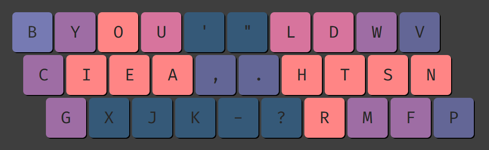
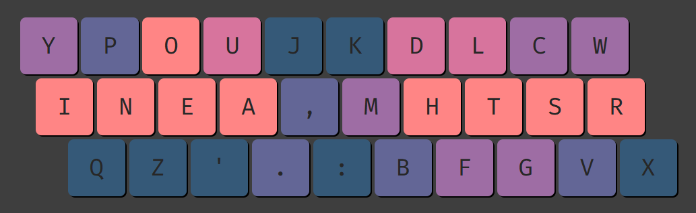

# **7. Lateral stretches (10 min)**

## 7.1. The center column

**The index finger inner keys are usually referred to as the ${\color{#ED1B23}center\ column}$.** These keys force us to shift our index finger sideways a bit in order to press them:

Identifying the center column gets trickier on row stagger keyboards. Compared to matrix, the letter ${\color{#2DCB70}I}$ is now shifted a bit to the left, while the letter ${\color{#2DCB70}N}$ is shifted to the right. In other words, ${\color{#2DCB70}N}$ and ${\color{#2DCB70}I}$ are shifted toward each other, making them closer than on matrix. However, the opposite is true for the letters ${\color{#ED1B23}E}$ and ${\color{#ED1B23}V}$, which are pushed further apart. Therefore, **despite the letter ${\color{#ED1B23}V}$ technically not being on the center column, it effectively feels more like a center column key on row stagger than ${\color{#2DCB70}N}$ does:**

The image above highlights the fact that standard keyboards are not symmetrical. **On row stagger keyboards, a bigram and its mirror (i.e. the same bigram but on the opposite hand) usually vary in length.** In fact, this is the case for Qwerty ${\color{#ED1B23}VE}$ vs ${\color{#2CC76E}NI}$.

## 7.2. Lateral stretch bigrams (LSBs)

In general terms, a **LSB is a bigram that pulls two of our fingers apart or that forces us to laterally shift our wrist a bit to go from one key to the other.**

The issue with trying to come up with a more specific LSB definition is that a bigram feeling like a lateral stretch or not depends on personal factors like:
- Our hand size.
- At which angle we place our wrists in relation to the keyboard.
- Whether we rest or float or wrists when typing.
- What type of keyboard we use (i.e. row stagger, matrix, columnar stagger).

In any case, the following is a possible LSB definition:

- **Adjacent finger bigrams where the horizontal distance is 2U or greater.** Usually, this involves pressing one key on the center column with the index finger, followed or preceded by another key with that hand’s middle finger (e.g. Qwerty ${\color{#ED1B23}TE}$, ${\color{#ED1B23}GE}$, ${\color{#ED1B23}BE}$...). Same applies to bigrams where we press one of the outer pinky keys followed or preceded by another key with that hand’s ring finger (e.g. Qwerty ${\color{#ED1B23}'O}$, ${\color{#ED1B23}'L}$...).

- **Semi-adjacent finger bigrams where the horizontal distance is 3.5U or greater.** This applies to some ring-index bigrams where the keyboard row stagger pushes the keys rather far apart (e.g. ${\color{#ED1B23}BW}$, ${\color{#ED1B23}BS}$...):

## 7.3. Lateral stretch skipgrams (LSSs)

The difference between a LSB and a LSS is that on the first the two keys forming the stretch are pressed consecutively, while on the later there is another key in between the two, pressed by a third finger. Since there is an in-between key that breaks the lateral stretch, LSSs are less noticeable than LSBs. 

Anyway, take Whix2 (angle modded):

The highlighted lines are hardly common LSBs, as the ${\color{#ED1B23}WR}$ & ${\color{#ED1B23}RV}$ bigrams are rare. However, **even if a letter pair does not lead to a LSB it may still lead to a LSS,** and that is the case with our layout example.

Specifically, `W_R` is a common skip-1-gram in words like `were`, `world` or `work`. So, quickly typing wor on the layout above forces us to shift our wrist laterally a bit (to go from `W` to `R`). Same thing would apply to `V_R` in words like `never`, `every`, `ever` or `over`.

## 7.4. Row stagger vs matrix LSBs

On matrix keyboards the rows are perfectly aligned vertically, but on row stagger they are not. Therefore, some lateral stretches vary greatly in length depending on the keyboard:

- The LSBs with the bigger discrepancy between row stagger and matrix are those where one key is on the bottom row and the other key is on the top row. These are 0.75U shorter/longer laterally on row stagger. For example, Qwerty `CT`:

	
	

- The disparity goes down to 0.5U when one key in the LSB is on the bottom row and the other key is on the home row. For instance, Qwerty `DB`:

	
	

- Finally, the difference is only 0.25U when one key in the LSB is on the top row and the other key is on the home row. For example, Qwerty `DT`:

	
	

### 7.4.1. LSBs on matrix only

If we use a lateral distance of 2U as the threshold for what counts as an adjacent finger LSB, then the following bigrams would qualify as lateral stretches on a matrix keyboard, but not on row stagger (the horizontal distance on row stagger drops to 1.75U, 1.5U or 1.25U depending on the bigram):

- On the left hand: Qwerty `TD`  `TC`  `GC` (index - middle)
- On the right hand: Qwerty `HI`  `NI`  `NK` (index - middle) and `L[`   `.[`  `.'` (ring - pinky)

<table>
<tr>
<td>Matrix</td>
<td>Row stagger (`C` pressed with the middle finger)</td>
<tr>
<td></td>
<td></td>
</tr>
</table>

Because of these differences, on programs like [Genkey](https://semilin.github.io/genkey/) that allow us to analyze a layout assuming either a row stagger or matrix keyboard, the LSB stat will usually be noticeably lower on row stagger than on matrix.

Basically, **placing letters on the center column is generally less problematic on row stagger keyboards.** That is assuming we take advantage of the stretches that are shorter on row stagger, and avoid the ones that become longer (listed in the following pages).

### 7.4.2. LSBs on row stagger only

If we use a lateral distance of 3.5U as the threshold for what counts as a semi-adjacent finger LSB, then the following bigrams would qualify as lateral stretches on a row stagger keyboard, but not on matrix (the horizontal distance drops to 3U on the later):

- On the left hand: Qwerty `BW` `BS` (index - ring)
- On the right hand: Qwerty `Y.` `H.` (index - ring)

<table>
<tr>
<td>Row stagger</td>
<td>Matrix</td>
</tr><tr>
<td></td>
<td></td>
</tr>
</table>

***TODO***
Lastly, although the bigrams below would technically not qualify as adjacent finger LSBs on row stagger (the lateral distance is 1.75U, just short of 2U) they feel noticeably more “stretchy” on row stagger than on matrix:

### 7.4.3. LSBs on both matrix and row stagger

#### Same length

***TODO***
Firstly, stretches that do not change in length regardless of the type of keyboard we use:

#### Longer on row stagger

Bigrams that qualify as LSBs on both row stagger and matrix, but are longer on the former:
- On the left hand: Qwerty `GE`, `BE`, and `BD` (index - middle)
- On the right hand: Qwerty `YK`, `Y,`, and `H,` (index - middle) also `O'` (ring - pinky)

<table>
<tr>
<td>Matrix</td>
<td>Row stagger</td>
</tr><tr>
<td></td>
<td></td>
</tr>
</table>

### 7.4.4. Angle mod specific LSBs

Although angle mod makes the left bottom row keys more comfortable to use, it also introduces additional stretches that layouts designed for angle mod should avoid.

Firstly, the two images below show the **index-middle LSBs that are added by angle mod.** Note that the ${\color{#2DCB70}green}$ lines would not qualify as LSBs, but the ${\color{#ED1B23}red}$ lines would.

<table>
<tr>
<td>
Standard fingering
(the middle finger presses C)
</td><td>
Angle mod fingering
(the middle finger presses X)
</td>
</tr><tr>
<td></td>
<td></td>
</tr>
</table>

Secondly, **angle mod introduces a couple of index-ring LSBs as well:**

<table>
<tr>
<td>
Standard fingering
(the ring finger presses X)
</td><td>
Angle mod fingering
(the ring finger presses Z)
</td>
</tr><tr>
<td></td>
<td></td>
</tr>
</table>

With angle mod, the bottom row middle and ring finger keys are further away from the center column. Consequently, the stretches involving those keys become larger. To mitigate this issue, we should place rare bigrams where the big stretches would be. That way we will rarely have to type them.

## 7.5. Vowel hand and LSBs

A common setup on keyboard layouts is to have a hand with vowels pinky, ring and middle, while the index finger is reserved for consonants. On such layouts, we usually see an `OE` or `OA` column on the middle finger:

<table>
<tr><td markdown=1><a href="https://github.com/Apsu/Canary#canary">Canary</a> (Eve)</td></tr>
<tr><td><pre>
w l y p k  z x o u ;
c r s t b  f n e i a '
 j v d g q  m h / , .
</pre></td></tr>
</table>

**Layouts with the above structure usually place the vowels on the right hand, as the letter `O` will cause smaller stretches on that side.** To visualize this, we will compare standard Canary with its mirrored version:

<table>
<tr>
<td>Canary (standard)</td>
<td>Canary (mirrored)</td>
</tr><tr>
<td></td>
<td></td>
</tr>
</table>

So, when mirroring the layout (not recommended) the `FO` and `MO` pairs become larger stretches. This is because, on row stagger, the top row middle finger key is closer to the center column on the right hand than on the left. 

Anyway, on matrix keyboards (which are symmetrical) we can mirror layouts more freely.

## 7.6. Minimizing stretches

### 7.6.1. Reducing center column use

If rather than simply reducing lateral stretches our issue is more with center column usage in general, then we could make a layout like [Engram](https://engram.dev/):

**Minimizing center column use to such an extent has a couple drawbacks, though:**
- **Higher pinky movement,** as more letters are pushed to the pinky corners.
- **Higher scissors.** Having said that, uncomfortable up-down motions can be greatly minimized with smart letter placings. For example, Engram does fine in that aspect.

A more middle-ground approach would be something like [Mtgap](https://mathematicalmulticore.wordpress.com/the-keyboard-layout-project/):

Now center column use is a bit higher, but in exchange each pinky has only one common letter off the home row (e.g. Engram had `BCG` & `VNP` pinkies, while Mtgap has just `YI` & `WR`).

### 7.6.2. Strategically avoiding stretches

**If we do not mind center column use as long as large stretches are avoided, all we have to do is place rare bigrams where the big stretches would be.** A layout that does this is **Wave eo** (angle modded). Note that in this layout the letter `M` should be pressed with the middle finger (there is a `DTMK` column). In any case, the red lines below show the longest stretches on row stagger.

We can see that those stretches are very rare bigrams on **Wave eo**, meaning we would rarely have to to perform those stretches:

The long angle mod specific stretches are also very rare bigrams on this layout:

The layout only places more common bigrams in locations that lead to smaller stretches:

So, having multiple letters on the center column (`B,` P, `Y` and `G`) did not lead to any big stretches in the layout. **The up-sides of having a few letters on the center column are:**
- **Lower pinky movement,** as less letters are pushed to the pinky corners.
- **Lower scissors,** as the bottom row middle and ring finger keys have lower use.
