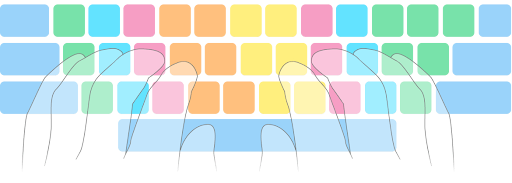
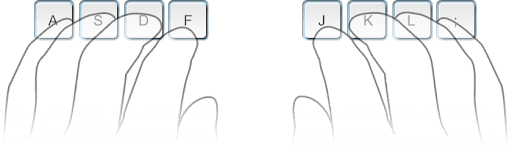
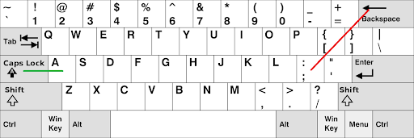

# Chapter 1: Touch typing (7 min)

Touch typing refers to developing the necessary muscle memory to be able to type without looking at the keyboard and without consciously thinking about it.

Proper touch typing technique involves using eight fingers (pinky, ring, middle and index of each hand). In the following image, each color highlights the keys assigned to that finger. The color code is as follows: green for pinky, light blue for ring, pink for middle, orange for left index, and yellow for right index. The space bar would be pressed by either thumb.



**We will refer to the model above as standard fingering.** There are many people who do not follow this model, as they learned to type on their own without the use of a typing tutor. However, **if we want to learn an alternative keyboard layout, we will also have to learn the correct typing technique, as layouts are designed with it in mind.** Otherwise, we won’t get the benefit of the layout.

If you currently do not use all your fingers when typing, arguably the best reason for learning a new layout is to take it as an opportunity to learn proper touch typing.

## The home row

The usual approach for learning touch typing is to break it in steps. The first step consists of getting used to typing the letters on the home row without looking at the keyboard. **The home row refers to the eight keys that act as the resting position for your fingers:**



The image above shows the home row on a standard [Qwerty](https://en.wikipedia.org/wiki/QWERTY) keyboard. We should be able to place our hands in this position without looking at the keyboard, by feeling with our index fingers the two small bumps in the F and J keys.

**Learning the home row before anything else will be very helpful, as we can then develop the muscle memory for the rest of the keyboard in relation to the home row.**

Note that, when we say that our fingers will be resting over ASDF JKL; , we are simply describing the physical location on the keyboard. The intention is to learn a keyboard layout other than Qwerty. Any modern layout will replace ASDF JKL; with more common letters.

## The top and bottom row

After learning the home row, the next step would be practicing the muscle memory for the row of keys that is directly above it, known as the top row. Lastly, we would do the same with the row of keys directly below the home row, which is referred to as the bottom row.

## How to learn a new layout

A useful tool for this is a word filter. The [MonkeyType](https://monkeytype.com/) website already has a word filter built in. To use it, near the top right corner, **click on custom → change → Words filter.**

By default, MonkeyType only uses the 200 most common English words to generate its tests. Before anything, we should click on **language** and select an expanded word set. English 1k includes the 1000 most common words in English, 5k includes the top 5000, etc...

In the word filter menu, we will see the following two boxes:


By adding a set of letters (separated by space) in include, and putting all the remaining letters in exclude, we can generate a typing test that uses only the letters we want. This in turn can be used to learn a layout in steps. 

For example, take the [MTGAP layout](https://mathematicalmulticore.wordpress.com/the-keyboard-layout-project/):
```
y p o u j  k d l c w
i n e a ,  m h t s r
q z ' . :  b f g v x
```

Let’s say we wanted to practice the home row. Firstly, we select a word set like English 1k. Secondly, we add all of MTGAP’s home row letters to the include box, and put all the remaining letters in exclude. Finally, we click **set**, resulting in the following word list:


All there is left to do is click on **random** (to randomize the order in which the above words will appear in the typing test) and select a duration for the test (either a number of words or of second). We can now practice MTGAP’s home row while typing actual words.

Once we are comfortable with the home row, we go back to the word filter screen and progressively move more letters from **exclude** to **include**, until we have learned all of them. How many steps this process should take is entirely up to you.

## Word tests

If we have already learned all the letters in our layout, then we do not need the word filter anymore. Now we can start using either the **time** or **words** settings on [MonkeyType](https://monkeytype.com/).

We can select how long the test will last (either a time in seconds, or how many words it will contain). The default is 50 seconds or 60 words. Regardless, we can change it.

Remember to practice on a bigger word set than the default English option, as that one only includes the 200 most common English words, and should only be used for speed typing.

## Punctuation and shift

By clicking on the **punctuation** option, we add basic punctuation to the test: comma `,`, period `.`, apostrophe `‘`, colon `:`, semicolon `;`, hyphen `-`, slash `/`, question mark `?`, exclamation point `!`, quotation marks `“”` and parentheses `()`.

Enabling punctuation also forces us to practice using Shift (the key with an arrow pointing upwards) in order to capitalize letters. **The correct technique is to use the Shift key of the hand opposite to the letter we want to capitalize.** In other words, if we want to capitalize a letter on the left hand, we should use the right Shift key (and vice versa).

The issue with using Shift on the same side as the letter we want to capitalize is that our fingers will be pulled apart (e.g. try holding the right Shift plus the letter Y on Qwerty). Although learning to use Shift correctly is tricky, it will be worth it in the long run.

## Quotes

Once we are comfortable with punctuation and Shift we can start using the **quote** setting to practice full sentences, rather than individual words as we had been doing until now.

We can select how long we want the quotes to be. There is even an option to search through all the quotes on MonkeyType to choose specific ones. If we want to practice texts of our own choice, we can click on **custom → change**, and paste our desired text.

## Swapping Caps lock and Backspace (on Windows)

Despite the Backspace key being a commonly used key, it is very far from the right pinky’s resting position, forcing us to make quite a jump to reach it. A fix some people do is moving Backspace to where Caps lock used to be, making Backspace more comfortable to press:



If you want to try the fix above, download and unzip the following [file](https://drive.google.com/file/d/1YJ18K7IExs46LcBsPWIDf6ejOMOpozrl/view?usp=sharing). Afterward, you can run the .reg file of your choice, and reboot your computer for it to take effect:

- Caps2BS.reg - Rebind Caps to Backspace
- SwapCapsBS.reg - Swap Caps and Backspace
- Caps2Ctrl.reg - Rebind Caps to Control
- SwapCapsCtrl.reg - Swap Caps and Control
- Unbind.reg - Undo All Rebinds

The first .reg file simply makes the Caps lock key act as a second Backspace. In other words, the old Backspace would still work, and we would not have a Caps lock key anymore.

With the second .reg file, Caps lock and Backspace are swapped. So, this option retains a Caps lock key, plus it forces us to get used to utilizing the new Backspace location.

Anyway, Credit goes to Ze_or for making the above file.
