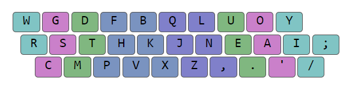

# Chapter 2: Angle mod (10 min)

## Improved typing technique

On standard keyboards, each row is shifted a bit to the side in relation to one another. This is known as the row stagger. **When using the standard finger technique, the row stagger only aligns well with our fingers on the right hand.** To help us visualize this, we will draw lines over the keyboard representing the natural up/down motion of our fingers. We are assuming that our arms approach the keyboard at an angle (70º or so) rather than being perpendicular to it:


On the right hand, the green lines match well with the keys assigned to each finger. However, the same is not true on the left hand, with the bottom row being particularly misaligned. **There is a modified finger technique that aims to fix this, known as Angle mod. It consists of changing the finger assignments for the left bottom row:**


Although angle mod makes the stagger on the bottom row the same on both hands, the stagger on the top row will still align better with our fingers on the right hand vs the left.
In any case, the following are the keys that change fingers:

| With standard fingering: | With angle mod fingering: |
| ------------------------ | ------------------------- |
| Qwerty Z → Pinky         | Qwerty Z → Ring           |
| Qwerty X → Ring          | Qwerty X → Middle         |
| Qwerty C → Middle        | Qwerty C → Index          |

## ANSI and ISO standards

The physical layout of the keyboard varies a bit depending on the country. **In the images below, the differences appear in blue:**

**ANSI** (American):


**ISO** (International):


**On ISO, the left shift key is split into two, while on ANSI it is not. This affects how angle mod is implemented on each.** The key difference is that, on ISO angle mod, the left pinky retains three keys just as with standard fingering. However, on ANSI angle mod the left pinky loses one key (now two total) while the left index finger gains one (now seven total). This will be better understood after seeing some practical angle mod examples.

Finally, note that, when angle mod is utilized later throughout this document it will be the ANSI version, as it works on any keyboard. ISO angle mod is exclusive to ISO keyboards.

## Angle modding a layout

**Modifying a layout that is arranged for standard fingering into one that uses angle mod fingering instead is known as angle modding the layout.** As already mentioned, this process is slightly different depending if we are using an ANSI or ISO keyboard.

### ANSI angle mod example

We start with [Colemak DH](https://colemakmods.github.io/mod-dh/) for standard fingering:


Angle modding a layout requires two steps on ANSI keyboards:

The letters inside the yellow box (i.e. the bottom row left ring, middle and index finger keys) are all shifted one position to the left.

Since the letter inside the orange box (i.e. the bottom row left pinky key) loses its old spot, it is now moved to the new vacant spot on the left index.

The result is [angle modded Colemak DH](https://colemakmods.github.io/mod-dh/#angle-mod):


**When angle modding a layout, the original columns should remain the same.** By “column” we are referring to the letters each finger is supposed to press. Note how, on both the original and the angle modded versions, the <span style="color:pink">left ring</span> has a `WRX` column, the <span style="color:green">left middle</span> a `FSC` column, and the <span style="color:blue">left index</span> a `PTD` column.

Lastly, for a layout to be easily “angle moddable'' on ANSI keyboards, the character inside the orange box (`Z` in our example) should be a rare letter. The reason for this is that said letter actually changes fingers (it is moved from the left pinky to the left index) meaning that it will create letter interactions that the original layout did not account for. This will not be an issue as long as it is a rare letter, though.

### ISO angle mod example

We start with [Colemak DH](https://colemakmods.github.io/mod-dh/) for standard fingering:


To [angle mod Colemak DH](https://colemakmods.github.io/mod-dh/#angle-mod) on a ISO keyboard, we simply have to shift the whole left bottom row one position to the left:


On ISO, thanks to the additional pinky key, we do not need to move the bottom row left pinky letter (Z in our case) to the left index. That was only necessary on ANSI keyboards. Regardless, it is technically possible to use ANSI angle mod on an ISO keyboard, if we want.

## Un-angle modding a layout

When exploring alternative keyboard layouts, we will find lots of angle modded layouts. This is because most layouts were designed with row stagger in mind, and angle mod is the recommended finger technique on such keyboards.

If we want to learn a layout that has already been angle modded, but we plan on using it on a matrix keyboard, then we will have to un-angle mod the layout. After all, angle mod only makes sense on row stagger. For example, take angle modded [Noctum](https://oxey.dev/noctum/):


If we were to learn this layout on matrix, we would un-angle mod it first, as follows:


## Errors to avoid with angle mod

### Learning a standard layout with angle mod fingering (angle cheat)

Take [APT](https://github.com/Apsu/APT#aptv3-layout) with standard fingering:


Imagine someone learned the layout above with angle mod fingering, but without actually angle modding the layout first. Doing so is known as “angle cheat”:


Here we are making the layout noticeably worse, as bigrams that used to be typed with two fingers (e.g. <span style="color:green">CT</span>, <span style="color:blue">MP</span>, <span style="color:blue">MB</span>...) are now typed with the same finger on the second version.

In order to respect the original layout’s columns, we need to actually angle mod it:



Anyway, both the first and third versions of the layout are correct, they just differ on the finger technique being utilized. The second version however has the columns wrong.

### Learning an angled modded layout with standard fingering

Take Rolly, which was designed with angle mod in mind:


Imagine someone learned the layout above with standard fingering, but without actually un-angle modding the layout first:


Here we have effectively ruined the layout, as `H` and `E` are now sharing a finger. Consequently, <span style="color:green">HE</span> becomes a very common [same finger bigram](chapters/chapter3.md#same-finger-bigrams-(sfbs)) (a bigram where one finger presses two keys in a row). Although the original angle modded version only had 0.752% [SFBs](chapters/chapter3.md#same-finger-bigrams-(sfbs)) on the [Colemak mods analyzer](http://colemakmods.github.io/mod-dh/analyze.html), the second one goes all the way up to 4.286%!

Let’s say we did un-angle mod the layout before applying standard fingering:


This way we are not causing unintended SFBs, as we are respecting the original columns. Having said that, on a row stagger keyboard, this third version would still be a downgrade compared to the first. This is because <span style="color:blue">H</span> and <span style="color:blue">P</span> are now much further apart from <span style="color:green">E</span> and <span style="color:green">U</span>, making bigrams like <span style="color:blue">H</span><span style="color:green">E</span>, <span style="color:blue">H</span><span style="color:green">U</span>, <span style="color:blue">P</span><span style="color:green">E</span> and <span style="color:blue">P</span><span style="color:green">U</span> less comfortable than before.

Anyway, the best version would be the very first one.

## How to tell if a layout is angle modded or not

Later in this document we will list and compare many different layouts. The layouts will often appear as just text. Depending on how that text is formatted, it will indicate one finger technique or the other:

**Standard fingering:**

<div style="width: 100%; overflow: hidden;">
<div markdown='1' style="width: 500; float: left;">

[Gallium](https://github.com/GalileoBlues/Gallium/) (Bryson)
```
b l d c v  z y o u ,
n r t s g  p h a e i
q x m w j  k f ' ; .
```

</div>
<div markdown='1'> 

For standard fingering, the columns will be strictly vertical. For example, the left hand on Gallium has a `BNQ` pinky, a `LRX` ring, a `DTM` middle and a `CSWVGJ` index.

</div>
</div>

**Angle mod fingering:**

<div style="width: 100%; overflow: hidden;">
<div markdown='1' style="width: 500; float: left;">

<span style="color:blue">Isrt</span> (Whorf)
```
y c l m k  z f u , '
i s r t g  p n e a o ;
 v w d j q  b h / . x
```

</div>
<div markdown='1'> 

For angle mod, the bottom row will be shifted one unit to the right. So, the left hand on Isrt has a `YI` pinky, a `CSV` ring, a `LRW` middle and a `MTDKGJQ` index. Remember that, with `ANSI` angle mod, the left pinky only has two keys, while the left index now has seven.

</div>
</div>

Sometimes we will use images (rather than text) to showcase a layout. In those cases, we will specify if the layout is angle modded or not to avoid any confusion. Regardless, as you become more familiar with layouts you will be able to easily tell if a layout is angle modded or not simply by glancing at the layout’s columns. For example:


The layout above has obviously been angle modded already. We can tell because its columns would not make sense otherwise. If we assume angle mod, we get a `BN` pinky, a `FSV` ring, a `DTM` middle and a `LRHZKXQ` index. Those are sensible columns on multiple fronts. For once, they cause negligible [same finger bigrams (SFBs)](chapters/chapter3.md#same-finger-bigrams-(sfbs)). Additionally, the weaker fingers have a low load (a `BN` pinky and a `FSV` ring) while the stronger fingers work harder. Instead, if we assumed that the layout above was not angle modded, we would get nonsensical columns (a `BNV` pinky, a `FSM` ring, a `DTH` middle and a `LRXZKQ` index).
