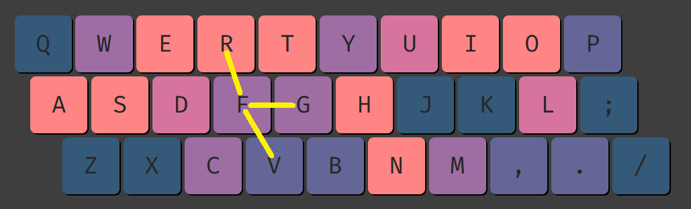

# Layout stats
## SFBs, SFSs and distance (18 min)

### Same finger bigrams (SFBs)

**A SFB consists of pressing two keys in succession with the same finger.** For example, take the word `decade` on Qwerty. The line shows letters pressed by the left middle:

<div style="width: 100%; overflow: hidden;">
<div markdown='1' style="float: left;">

	 ```
	 ┌┬┬─┬┐
	 decade
	 ```

</div>
<div markdown='1'> 

So, this word contains three SFBs: `DE`, `EC` and `DE` again. This is an extreme example, as five out of six letters are typed with one finger!

**SFBs are dependent on which letters are sharing a column.** For example, Qwerty’s **EDC** column is very poor, as it leads to lots of SFBs.

</div>
</div>

As a reference, [Qwerty](https://en.wikipedia.org/wiki/QWERTY) has around 6% SFBs, [Dvorak](https://en.wikipedia.org/wiki/Dvorak_keyboard_layout) 2.5% and [Colemak](https://en.wikipedia.org/wiki/Colemak) 1.5%. Modern layouts can go as low as 0.5%. It should be noted that these numbers can vary greatly depending on the analyzer and corpus being utilized. For example, Qwerty may receive 4.5% SFBs in a different analyzer. All that matters is how layouts perform in relation to one another. In that sense, Qwerty will always have high SFBs, regardless of the analyzer.

When we say that a layout has a certain SFB percent, we are assuming that the layout is being utilized with proper [touch typing](chapters/chapter1.md#touch-typing). Advanced Qwerty users often use personalized fingerings (e.g. they press the letter C with the index finger, rather than with the middle) in order to avoid SFBs like CE . This is referred to as “alt fingering” and will be explored later.

Aside from the overall SFB percentage, we should also pay attention to how the SFBs are being distributed across the fingers. Generally, **we will favor SFBs being on the index and the middle fingers, and avoid them on weak fingers like the pinkies.**

Another thing to keep in mind is that **lowering SFBs past a certain point will produce diminishing returns.** For instance, the layouts with the lowest SFBs also have the lowest home row use. Additionally, they have lower index finger usage. Finally, they often have higher pinky movement. So, we should not disregard other stats when optimizing SFBs.


### Calculating the distance between two keys

Let’s say we want to know the distance for Qwerty `RG` (we are using Qwerty as a method to refer to the different keys on the keyboard):


We can obtain the length of the red line by using [Pythagoras' theorem](https://en.wikipedia.org/wiki/Pythagorean_theorem). All we need to know is the vertical distance between the two keys (the green line) and the horizontal distance (the blue line).

**On a row stagger keyboard, the top row is horizontally shifted 0.25 units in relation to the home row, and the bottom row is shifted 0.5 units.** This makes the horizontal distance between the top row and bottom row to be 0.75 units. As for vertical distance, the top and the bottom row are each 1 unit away from the home row.

In our Qwerty `RG` example, the vertical distance is 1U and the horizontal distance is 1.25U (1U from `G` to `F`, and 0.25U from `F` to `R`). Knowing this, we can use Pythagoras to determine the distance between the two keys. We have to square both the horizontal and vertical distances, and then square root the sum:

$`c = \sqrt{a^2+ b^2} = \sqrt{1.25^2 + 1^2} = 1.60 U$`$

`RG` is a 1.6U SFB

Another example, Qwerty `MY`. The vertical distance is 2U and the horizontal one 1.75U (1U from `M` to `N`, 0.5U from `N` to `H`, and 0.25U from `H` to `Y`). Thus:

$`\sqrt{1.75^2 + 2^2} = 2.66 U$`$

`MY` is a 2.66U SFB

One final example, Qwerty `VT`. The vertical distance is 2U and the horizontal one 0.25U (from `V` to `G` it would be 0.5U, but then we subtract 0.25U going from `G` to `T`). Thus:

$`\sqrt{0.25^2 + 2^2} = 2.02 U$`$

`VT` is a 2.02U SFB


### 1U and 2U SFB

Using the method explained above, we will now list the distance for the different SFBs. In this section we look at either 1U or 2U ones. In the following section we check the rest.

**If the two keys that form a SFB are on adjacent keys, then it will be around 1U.** In the image below, Qwerty `FG` is exactly 1U, `FR` is 1.03U, and `FV` is 1.12U:



**If one of the keys is on the bottom row and the other on the top row, then the SFB will be around 2U.** In this case, our finger has to jump over the home row to go from one key to the other. Below, Qwerty `VT` & `NU` are 2.02U, while `VR` & `NY` are 2.14U:


Naturally, **the SFBs we do have in a layout should mostly be 1U.** In other words, 2U SFBs should be reserved for rare bigrams only. The Qwerty layout clearly fails in this regard.

### Diagonals

Traditional keyboards are not symmetrical. For instance, the distance between the left index’s resting position (F) and its bottom diagonal (B) is larger than the distance to the top diagonal (T). Below, Qwerty FT is 1.25U, while FB is 1.8U:


On the right side it is the opposite. Now it is the top diagonal that is further away. Below, Qwerty JY is 1.6U, Qwerty JN is 1.12U:


So, from best to worst (i.e. from closest to furthest): Qwerty N → T → Y → B.

The absolute longest diagonals are Qwerty RB and MY which are 2.66U! There is also MH which is is 1.8U, and RG being is 1.6U:


Finally, when using angle mod fingering (Qwerty C being pressed with the index finger, rather than the middle), we add two other diagonals: Qwerty CT (2.36U) and CG (1.8U):


Anyway, the bigger the distance, the higher priority not to have that diagonal as a SFB in a layout.

### Same finger Skipgrams (SFSs)

A SFS consists of pressing two keys with the same finger, but separated by X letters. An example would be typing may on Qwerty (M and Y are both typed with the right index).

There are two aspects to SFSs: distance, and how many keys there are of separation. For example, the aforementioned M_Y SFS is 2.66U, and it is a skip-1-gram (i.e. in between M and Y, there is only one key, A, being pressed by a different finger).

The M_Y SFS is the worst of both worlds. Firstly, our right index finger must make a huge jump to go from M to Y. Secondly, this is done almost consecutively, as there is a single letter, A, of separation. Having more keys in between, before a particular finger is needed again, is better, as it gives our finger more time to go back to its resting position (J in this case). An ideal word would be one where each finger is only utilized once.

Qwerty is unfortunately full of words that are typed with just two fingers. For example, the word burn is typed by alternating both index fingers. In the image below, the orange line shows letters pressed by the left index. Yellow for right index:

So, this word contains two SFSs. Not only that, but the B_R SFS on the left index is 2.66U, and U_N on the right index is 2.02U. Try typing it.

Another example would be thought on Qwerty. Same color/finger pairings as above:

Here, T_G is a same finger skip-3-gram (i.e. there are three letters separating T and G). Therefore, that SFS will be barely noticeable, especially when compared to H_U, U_H or G_T, all of which are SF skip-1-grams. This time they are only 1U, though. Try typing it.

So, Qwerty performs terribly at SFSs. The benefit of optimizing SFSs is that each word will be spread across more fingers. Moreover, when we do have to use any particular finger almost consecutively, the distance between the two keys will be minimal.

### Distance on a layout

For the longest time, distance used to be measured as “distance off the home row”. In other words, it was assumed that pressing keys on the home row required no movement, while pressing keys outside the home row did. However, this is a great oversimplification. Take the word refer on Qwerty for example:

If you quickly type this word, you will find that pressing the second E requires no movement (despite E being on the top row) as our left middle finger was already over it. Meanwhile, even though F is on the home row, pressing it implicates moving our left index downward.

This goes to show that, to accurately measure the distance it will take to press a key, we need to keep track of which key that finger had pressed beforehand. This does not only apply within a given word, but also to the connections between words. For example, imagine typing the word when followed by you on Qwerty:

The yellow line shows letters pressed by the right index. The letter N in when is followed by a space, and right after our right index has to jump over the home row to press Y. Therefore, N_Y is an inter-word (i.e. in between words) SFS, while H_N or Y_U are intra-word (i.e. within a word) SFSs.

With all this in mind, the simplest way to measure how a layout performs at SFB distance is to scale each SFB by its distance. For example, if the frequency of a SFB is 0.4% and the distance is 1.2, we simply multiply 0.4 by 1.2. Then we do the same for all the remaining SFBs in the layout. Same applies to the SFSs, to get the SFS distance.

The method above keeps SFB and SFS distances as separate stats. A more elaborate approach is to combine both stats into one, but penalizing consecutive finger usage more than semi consecutive usage. For example, we could weight SFB distance by 1, SF skip-1-gram distance by 0.5, and then drop off exponentially (e.g. skip-2-grams by 0.25, skip-3-grams by 0.125). This allows us to account for all skipgrams (not just skip-1-grams).

Moreover, this later approach can be used to calculate the movement per finger. With “movement” being SFB + SFS distance. It will sometimes also be referred to as “finger speed”. Regardless, the purpose of finger speed is to, given a group of letters (3 letters on pinky, ring or middle, 6 on index) tell us how to arrange those letters so that SFB + SFS distance is minimized. The Genkey and Oxeylyzer analyzers calculate distance in this way.

### Decentivicing 2U SFBs and SFSs

As explained earlier, to calculate the distance between two keys we simply have to square both the horizontal and vertical distances, and then square root the sum. Doing that, Qwerty RT would be 1U, RG 1.6U, RV  2.02U and RB 2.66U:


However, in order to calculate the distance or movement per finger (i.e. “finger speed”) analyzers like de Genkey or Oxeylyzer will not square root the sum. Therefore, Qwerty RT would still be 1U, but RG would now be 2.56U, RV 4.56U and RB 7.06U!

The point of omitting the square root when measuring distance is to punish longer distances more severely (2U SFBs will now be punished 4 times as hard as a 1U). This results in the analyzer outputting layouts where most of the SFBs and SFSs are only 1U.

### Weights for each finger

On Genkey and Oxeylyzer, distance is weighted based on each finger's strength or dexterity level. The following are the default weights on Genkey (Oxeylyzer uses the same ones, although it does not allow us to customize them, while Genkey does):

Index:  5.5
Middle: 4.8
Ring:   3.6
Pinky:  1.5

Basically, the purpose of these weights is to establish that weaker fingers (e.g. pinky) can handle much less movement than stronger fingers (e.g. index). Using that information, the analyzer can then spread movement accordingly when making a layout.

### Distributing movement across the fingers

Even if we discard letter columns that perform poorly at SFB and SFS distance, the English language still offers a lot of flexibility regarding how to arrange the alphabet to construct keyboard layouts.

There is a key concept we need to be aware of when designing layouts. To explain it we will use an analogy. Think of a balloon full of air. If we press down on it, air will be displaced to other parts of the balloon. The same is true for finger movement in keyboard layouts. If we place little effort in one part of the layout, more effort will be displaced elsewhere.

To help us visualize this we will use a few layout examples. All of them will share the exact same right hand (the vowel hand). Then, we will use the remaining consonants to come up with different arrangements for the left hand. The point being that each consonant home row will distribute movement differently across the fingers.
Rsnt
x f h m z
r s n t v
q b l d k
Snht
v r l d z
s n h t k
q x m b f
Nstr
b f d l z
n s t r k
q v m h x
Srht
f l n d k
s r h t v
q x b m z
Vowel hand
' w o u j
y c a e i
p g . - ,

The following table shows the movement (according to Genkey when using the MonkeyType + TypeRacer corpus) of each finger on the consonant hand:


Pinky
Ring
Middle
Index
Top row pinky
Rsnt
0.16
1.89
8.94
11.07
0.1% (x)
Snht
0.67
3.92
5.78
11.33
1.1% (v)
Nstr
0.68
1.41
5.83
14.03
1.4% (b)
Srht
0.75
2.62
5.35
11.07
2% (f)


On Rsnt the ring and especially the pinky are very relaxed, yet center column use is low as well. The drawback is that the middle finger has to make up for it. By comparison, on Snht ring finger movement almost doubles and top row pinky use increases by 1%, but in return middle finger movement is much lower than before. Nstr purposely concentrates movement on the index finger, where the SFBs can be comfortably alt fingered. Lastly, Srht has the least overall movement, at the expense of top row pinky use being the highest.

4.10. Distance on Qwerty
q w e r t  y u i o p
a s d f g  h j k l ;
z x c v b  n m , . /

There are three fingers that have extremely high movement on Qwerty:

The left middle’s high distance is explained by the common ED and DE SFBs & SFSs, and even more so by EC and CE, as these last two are 2U.

On the left index, the letter R causes lots of SFBs: TR, RT, FR, also GR (1.6U) and BR (2.66U). There are plenty of SFSs as well: TR, FR, RT, BT and VR (the last two are 2U).

The right index does poorly at distance, as all its SFBs are 2U or more: UN, NY, UM, MU and MY. As for SFSs, the main ones are MN, HN and YU, all of which are 1U. However, there are 2U SFSs as well: UH, UN and NY.

Finally, although the right ring is not anywhere as bad as the prior three, it is poor nonetheless, as it has the common LO and OL (1U) SFBs and SFSs.

Anyway, the point is that Qwerty was not optimized with SFB and SFS distance in mind.

4.11. Examples of bad words on Qwerty

In the following sections we list words that are tricky to type as they involve Qwerty’s problematic fingers: left middle, left index, right index (and to a lesser extent right ring).

For each word example, colored lines will indicate the keys pressed by each finger. This aims to accomplish two things. Firstly, it allows us to easily visualize SFBs and SFSs, to ensure the concept is understood well. Secondly, it makes Qwerty’s flaws more apparent.

For example, take the word decided on Qwerty:

A single colored line points to most of the letters, indicating they are all pressed by the same finger. So, this is a heavy SFB word.

Now take the word amendment instead:

Here there are two lines, for two fingers. Furthermore, there is always a one letter gap before a finger is utilized again, indicating SFSs. So, this would be a heavy SFS word.

The color code for the different fingers is as follows:

- Yellow indicates keys pressed by the right index finger. So, in this example NUM would be a SF trigram (NU being 2U and UM 2.1U).
- Orange for the left index finger. So, B_R is a 2.66U SFS.
- Green for the left middle finger. E_E is a SFS followed by a SFB (ED).
- Blue for the right ring finger (does not appear in this example).
- Grey for the remaining fingers

If a finger only presses a single letter in a word, no line will be shown, as SFB and SFS distance for that finger would be zero. Furthermore, there won’t be a line either for SFSs deeper than a skip-3-gram (i.e. skip-4-grams, etc…) as they stop being relevant.

4.11.1. Heavy SFS words on Qwerty

Note: SFSs that involve pressing the same key twice require no movement, as our finger is already over said letter after the first press. An example of such a SFS would be E_E.

Words typed mostly by alternating two fingers:


Words with all their SFSs on one finger:


4.11.2. Heavy SFB words on Qwerty


Word with high distance (SFBs and SFSs) on the right index finger:


Word with high distance (SFBs and SFSs) on the left middle finger:


## Alt fingering, SFB collisions and sliding (6 min)

### Alt fingering

Using a finger other than the “intended” one to type a certain bigram, with the purpose of avoiding a SFB, is referred to alt fingering. For example, if we use standard fingering on Qwerty, the CE and EC bigrams are 2U SFBs:


Instead, to remove the aforementioned SFBs we can alt finger CE/EC by pressing C with the index finger (rather than the middle). This is what many advanced Qwerty users do.

### SFB collisions

A collision refers to when alt fingering a SFB creates a new SFB. For instance, with standard fingering, CT is not a SFB on Qwerty. However, if we alt finger EC by pressing C with the index, then CT does become a SFB specifically on the ECT trigram:


Ideally, we should aim to minimize SFB collisions, but they are sometimes unavoidable.

### Designing a layout with alt fingering in mind

Although alt fingering can be used to circumvent some of the issues of bad layouts like Qwerty, we are mainly interested in using it to further improve well optimized layouts.

If we do not ever deviate from either standard fingering or angle mod, we can only minimize SFBs up to a certain point, as we are restricted by English’s bigram frequency. In order to reduce SFBs further, we can purposely place a few SFBs in a location where they are comfortable to alt finger. A layout that does this is Noctum which has three intended alt fingers: RK, RL and LK. Note that below the layout has been angle modded:


To alt finger RK we press R with the middle finger, and K with the index. Since RK is never followed by one of the letters on the index (i.e. trigrams like RKR, RKL or RKH are nonexistent) this alt finger will not cause SFB collisions. The LK alt (typed by pressing L with the middle finger and K with the index) is also free of SFB collisions.

The RL alt finger (R with the index, L with the middle) does introduce a SFB collision in the word WORLD, as both L and D are pressed with the middle finger in this case. A possible solution would be to introduce yet another alt finger, and press the letter D with the ring finger in this specific case. Some people might argue that if to remove one SFB (RL) we must perform two alt fingers (RL and LD), then it is preferable to just type the SFB normally.

### Most comfortable alt fingers

It is generally agreed that the best location to place a SFB that we intend to alt finger is the index finger. That way we can comfortably press one of the two index finger keys with the middle finger. Furthermore, we will often use keys that are adjacent to one another for alt fingers. This is done so that, if the SFB is typed normally, it will only be 1U.

#### On row stagger

Standard keyboards are not symmetrical. Therefore, a bigram and its mirror (i.e. the same bigram but on the opposite hand) may vary in length. We will compare each alt finger to its mirror. The more comfortable of the two will be shown in green, the other in yellow.


Qwerty FR (index → middle) is an easy alt. This is because the stagger makes it so R is very close to the middle finger’s resting position (D). On the right hand, K is noticeably further away from U, making JU a bigger jump for the middle finger.

Qwerty UH (middle → index) is very comfortable on the right hand. Its mirror (RG) forces us to splay our fingers a bit more, as the keys are further apart. Having said that, RG does require a smaller jump from the middle finger.

Qwerty RT (middle → index) is nicer than its mirror (UY) simply because T is closer to the index finger’s resting position (F) than Y is to J. Same reasoning applies to Qwerty MN being better than VB.

Qwerty DC (middle → index) is a possible alt finger if we use standard fingering. If we used angle mod instead, it wouldn’t be an alt finger, but CV would become one.

Qwerty FG is identical to JH, and so are FV and JN.

Anyway, if we have a common index finger SFB in our layout of choice, we can turn it into a comfortable alt finger by placing it in one of the lines above.

#### On matrix

On matrix keyboards there are fewer comfortable alt fingers than on row stagger. This is because the row stagger happens to be useful for alt fingering in particular.
For example, compare the “vertical alt fingers” on row stagger vs matrix:


The fact that on row stagger each row is a bit shifted to the side in relation to one another is what made the alt fingers above comfortable. It allowed us to use the middle finger to press one of the index finger keys without our fingers feeling cramped.

Furthermore, some of the center column diagonals (namely Qwerty N & T) are easier to press on row stagger, as they are closer to our index finger’s resting position. Therefore, alt fingers involving those keys work better on row stagger as well.

Anyway, the following alts remain basically the same regardless of the keyboard type:


### Sliding

Similarly to alt fingering, sliding is an alternative method for typing SFBs. It consists of sliding our finger downwards, going from the first key in the SFB to the second. An example of a layout were people might use sliding is Dvorak:


On the right hand, all the SFBs happen to go downwards as shown by the arrows. For example, the GH SFB only happens in the direction G → H. To type it, we could press the letter G and then slide our index finger downwards to H. Whether someone prefers doing that or typing the SFB normally is a matter of personal preference.

Note that sliding is intended for flat laptop keyboards. On keyboards with taller keycaps, sliding our finger over the gap between the two keys will not be as comfortable.

## Scissors (9 min)

### Row skips vs scissors

A row skip or row jump is any bigram where one finger reaches to the top row and another finger on that same hand contracts to hit the bottom row. A popular layout that minimizes row skips is Mtgap:
Mtgap (Michael Dickens)
y p o u j  k d l c w
i n e a ,  m h t s r
q z ' . :  b f g v x

The issue with minimizing all up-down motions is that it limits layouts design significantly. Furthermore, not every up-down motion is equal. So, rather than penalizing all up-down movements the usual approach is to utilize the “scissor” concept, which penalizes some up-down motions but not others. The Canary layout was made with that mindset:
Canary (Eve)
w l y p k  z x o u ;
c r s t b  f n e i a '
 j v d g q  m h / , .

The difficulty with defining scissors is that, unlike row skips, they are intrinsically subjective as not everyone will agree on which up-down motions should be included or excluded. In any case, a definition is proposed below.

### Full scissors bigrams (FSBs)

A FSB is a bigram where:
The vertical separation between the keys is two rows.
The finger that prefers being higher is not. This includes bigrams where the middle finger is lower than any other finger, and bigrams where the ring is lower than the pinky or the index.

To understand the suggested scissor definition, we will use the following images. The red lines indicate scissors, while the green lines are the preferred finger patterns. The first image shows adjacent finger pairings, the second shows non adjacent pairings:


On the left hand, the red lines show bigrams where the longer finger is lower than the shorter one. On the right hand it is the opposite (the longer finger is now higher). If you try both, you will likely find the green lines to be noticeably more comfortable to type.

Although accounting for finger length is important, we also have to consider the fact that our arms approach the keyboard at an angle. That is to say, our wrists are not at a 90º angle in relation to the keyboard, but closer to 70º. This naturally places the index finger a bit closer to the bottom row, and the pinky closer to the top row. Anyway, the preferred placements for each finger (in relation to the other finger in the bigram) will be:
The index prefers being lower.
The middle prefers being higher.
The ring prefers being higher than index and pinky, but lower than the middle.
The pinky prefers being lower than middle and ring, but higher than index.

### Other potential scissors

One issue some people might have with the above scissor definition is that, for a given finger pairing (e.g. pinky-ring), only one of the two possible movements is counted as a scissor. For example, most people will agree that the ring finger being lower than the pinky is more uncomfortable than the other way around. Despite that, some will argue that the opposite movement (i.e. pinky bottom row - ring top row) should be penalized regardless.

The main up-down motions that could be added to the earlier scissor definition are bigrams where the pinky is lower than the ring, or the ring is lower than the middle:


So, even though the longer finger is higher, one might choose to count those bigrams as scissors anyway. Note that when using traditional fingering on row stagger the above bigrams become more uncomfortable on the left hand because of the steep angle:


### Scissor angle

The angle between the two keys has a significant impact on how a scissor will feel. For instance, the following are the middle-index scissors when using standard fingering on a row staggered keyboard (the letter C is pressed by the middle finger):


Generally, steeper angles have a more distinct scissor feel, while shallower angles introduce a lateral stretch component. For example, on Qwerty CR the main issue is the up-down motion where our fingers almost cross each other. By comparison, on Qwerty ,Y the lateral stretch becomes a more noticeable problem. 

### Full scissor skipgrams (FSSs)

The difference between a FSB and a FSS is that on the first the two keys forming the scissor are pressed consecutively, while on the later there is another key in between the two, pressed by a third finger. The fact that there is an in-between key that breaks the scissor means that FSSs are less noticeable than FSBs.

### Half scissors bigrams (HSBs)

A HSB is a bigram where:
The vertical separation between the keys is only one row.
The finger that prefers being higher is not. This includes bigrams where the middle finger is lower than any other finger, and bigrams where the ring is lower than the pinky or the index.

In other words, the only difference between a full scissor and a half scissor is that the vertical separation between the two keys is cut in half. Naturally, this makes half scissors much less problematic than full scissors, although they are still not ideal.

In the images below the red lines indicate half scissors, while the green lines are the preferred finger patterns. The first image shows adjacent finger pairings, the second shows non adjacent pairings:


### Half scissor skipgrams (HSSs)

The difference between a HSB and a HSS is that on the first the two keys forming the half scissor are pressed consecutively, while on the later there is another key in between the two, pressed by a third finger.

### Keysolve analyzer

To obtain the scissor and half scissor stats for a given layout we can use keysolve. The only difference between the scissor definition proposed in this document and the keysolve one is that keysolve counts all ring-middle bigrams as a scissor, independently of which of the two fingers is higher.

### Minimizing scissors

#### Reducing bottom row usage

A straightforward way of minimizing scissors is to place only rare characters on the bottom row middle, ring and pinky keys. A layout that does this is Canary:


We can see that the keys inside the red blocks have low usage. On the left hand there are no scissors, as Q, J and V rarely combine with the letters on the top row. Same applies for punctuation on the right hand. With this approach, the only part of the bottom row that is heavily utilized are the index finger keys. Any layout that arranges the bottom row this manner will perform well at scissors.

#### Strategically avoiding scissors

Take the following layout:


There is a lot of up-down motion on the left hand: WH, BL, LD and LK. Having said that, this can be easily solved simply by swapping which letters are on the top or bottom row:


All the letters remain on the same fingers, yet the scissors have been greatly reduced. Point being, with smart letter placings it is possible to have relatively low scissors despite having common letters on the bottom row middle or ring finger keys. Still, the layouts with the least scissors will often place only rare letters in those locations.

#### Common scissors in layouts

On the vowel hand, scissors usually come from punctuation. An extreme example are layouts which utilize the YI OA UE vowel block and then place punctuation right below it. For example, take Semimak:


So, when a letter on the top row is followed by a punctuation symbol, we get a scissor.

On the consonant hand, the letter that can lead to the most scissors is L. The reason for this is that L almost never goes on the home row, yet it combines with all the letters that are often relegated to the top or bottom row (Y, D, P, B, C, F, G...). So, when L is on the top/bottom row and any of the aforementioned letters is on the opposite row, we get a scissor. An extreme example would be Hands Down Neu:


Another letter that sometimes causes scissors is M. Thankfully, M only really causes scissors with B and P, making it much more flexible than the letter L.

## Lateral stretches (10 min)

### The center column

The index finger inner keys are usually referred to as the center column. These keys force us to shift our index finger sideways a bit in order to press them:


Identifying the center column gets trickier on row stagger keyboards. Compared to matrix, the letter I is now shifted a bit to the left, while the letter N is shifted to the right. In other words, N and I are shifted toward each other, making them closer than on matrix. However, the opposite is true for the letters E and V, which are pushed further apart. Therefore, despite the letter V technically not being on the center column, it effectively feels more like a center column key on row stagger than N does:


The image above highlights the fact that standard keyboards are not symmetrical. On row stagger keyboards, a bigram and its mirror (i.e. the same bigram but on the opposite hand) usually vary in length. In fact, this is the case for Qwerty VE vs NI.

### Lateral stretch bigrams (LSBs)

In general terms, a LSB is a bigram that pulls two of our fingers apart or that forces us to laterally shift our wrist a bit to go from one key to the other.

The issue with trying to come up with a more specific LSB definition is that a bigram feeling like a lateral stretch or not depends on personal factors like:
Our hand size.
At which angle we place our wrists in relation to the keyboard.
Whether we rest or float or wrists when typing.
What type of keyboard we use (i.e. row stagger, matrix, columnar stagger).

In any case, the following is a possible LSB definition:

Adjacent finger bigrams where the horizontal distance is 2U or greater. Usually, this involves pressing one key on the center column with the index finger, followed or preceded by another key with that hand’s middle finger (e.g. Qwerty TE, GE, BE…).
Same applies to bigrams where we press one of the outer pinky keys followed or preceded by another key with that hand’s ring finger (e.g. Qwerty 'O, 'L…).


Semi-adjacent finger bigrams where the horizontal distance is 3.5U or greater. This applies to some ring-index bigrams where the keyboard row stagger pushes the keys rather far apart (e.g. BW, BS…):


### Lateral stretch skipgrams (LSSs)

The difference between a LSB and a LSS is that on the first the two keys forming the stretch are pressed consecutively, while on the later there is another key in between the two, pressed by a third finger. Since there is an in-between key that breaks the lateral stretch, LSSs are less noticeable than LSBs. Anyway, take the following angle modded layout:


The highlighted lines are hardly common LSBs, as the WR & RV bigrams are rare. However, even if a letter pair does not lead to a LSB it may still lead to a LSS, and that is the case with our layout example.

Specifically, w_r is a common skip-1-gram in words like were, world or work. So, quickly typing wor on the layout above forces us to shift our wrist laterally a bit (to go from w to r). Same thing would apply to v_r in words like never, every, ever or over.

### Row stagger vs matrix LSBs

On matrix keyboards the rows are perfectly aligned vertically, but on row stagger they are not. Therefore, some lateral stretches vary greatly in length depending on the keyboard:

The LSBs with the bigger discrepancy between row stagger and matrix are those where one key is on the bottom row and the other key is on the top row. These are 0.75U shorter/longer laterally on row stagger. For example, Qwerty CT:


The disparity goes down to 0.5U when one key in the LSB is on the bottom row and the other key is on the home row. For instance, Qwerty DB:


Finally, the difference is only 0.25U when one key in the LSB is on the top row and the other key is on the home row. For example, Qwerty DT:


#### LSBs on matrix only

If we use a lateral distance of 2U as the threshold for what counts as an adjacent finger LSB, then the following bigrams would qualify as lateral stretches on a matrix keyboard, but not on row stagger (the horizontal distance drops under 2U on the later):

On the left hand: Qwerty TD  TC  GC (index - middle)
On the right hand: Qwerty HI  NI  NK (index - middle) and L[   .[  .' (ring - pinky)

On matrix:


On row stagger, using standard fingering (C pressed with the middle finger):


Because of these differences, on programs like Genkey that allow us to analyze a layout assuming either a row stagger or matrix keyboard, the LSB stat will usually be noticeably lower on row stagger than on matrix.

Basically, placing letters on the center column is generally less problematic on row stagger keyboards. That is assuming we take advantage of the stretches that are shorter on row stagger, and avoid the ones that become longer (listed in the following pages).

#### LSBs on row stagger only

If we use a lateral distance of 3.5U as the threshold for what counts as a semi-adjacent finger LSB, then the following bigrams would qualify as lateral stretches on a row stagger keyboard, but not on matrix (the horizontal distance drops to 3U on the later):

On the left hand: Qwerty BW BS (index - ring)
On the right hand: Qwerty Y. H. (index - ring)

On row stagger:


On matrix:


Lastly, although the bigrams below would technically not qualify as adjacent finger LSBs on row stagger (the lateral distance is 1.75U, just short of 2U) they feel noticeably more “stretchy” on row stagger than on matrix:


#### LSBs on both matrix and row stagger

Same length

Firstly, stretches that do not change in length regardless of the type of keyboard we use:


Longer on row stagger

Bigrams that qualify as LSBs on both row stagger and matrix, but are longer on the former:
On the left hand: Qwerty GE  BE and BD (index - middle)
On the right hand: Qwerty YK  Y, and H, (index - middle) also O' (ring - pinky)

On matrix:


On row stagger:


#### Angle mod specific LSBs

Although angle mod makes the left bottom row keys more comfortable to use, it also introduces additional stretches that layouts designed for angle mod should avoid.

Firstly, the two images below show the index-middle LSBs that are added by angle mod. Note that the green lines would not qualify as LSBs, but the red lines would.

Standard fingering
(the middle finger presses C)


Angle mod fingering
(the middle finger presses X)


Secondly, angle mod introduces a couple of index-ring LSBs as well:

Standard fingering
(the ring finger presses X)


Angle mod fingering
(the ring finger presses Z)


We can see that, with angle mod, the bottom row middle and ring finger keys are now further away from the center column. Consequently, the stretches involving those keys will be larger. To solve this, we should place rare bigrams where the big stretches would be. That way we will rarely have to type them.

### Vowel hand and LSBs

A common setup on keyboard layouts is to have a hand with vowels pinky, ring and middle, while the index finger is reserved for consonants. On such layouts, we usually see an OE or OA column on the middle finger:
Canary (Eve)
w l y p k  z x o u ;
c r s t b  f n e i a '
 j v d g q  m h / , .

Layouts with the above structure usually place the vowels on the right hand, as the letter O will cause smaller stretches on that side. To visualize this, we will compare standard Canary with its mirrored version:
Canary (standard)
Canary (mirrored)


So, when mirroring the layout (not recommended) the FO and MO pairs become larger stretches. This is because, on row stagger, the top row middle finger key is closer to the center column on the right hand than on the left. 

Anyway, on matrix keyboards (which are symmetrical) we can mirror layouts more freely.

### Minimizing stretches

#### Reducing center column use as a whole

If rather than simply reducing lateral stretches our issue is more with center column usage in general, then we could make a layout like Engram:


Minimizing center column use to such an extent has a couple drawbacks, though:
Higher pinky movement, as more letters are pushed to the pinky corners.
Higher scissors. Having said that, uncomfortable up-down motions can be greatly minimized with smart letter placings. For example, Engram does fine in that aspect.

A more middle-ground approach would be something like Mtgap:


Now center column use is a bit higher, but in exchange each pinky has only one common letter off the home row (e.g. Engram had BCG & VNP pinkies, while Mtgap has just YI & WR).

#### Strategically avoiding stretches

If we do not mind center column use as long as large stretches are avoided, all we have to do is place rare bigrams where the big stretches would be. A layout that does this is Wave eo (angle modded). Note that in this layout the letter M is pressed by the middle finger (there is a DTMK column). In any case, the bigrams connected by the red lines below are very uncommon, meaning we would rarely have to perform those stretches:


The long angle mod specific stretches are also very rare bigrams on Wave:


The layout only places more common bigrams in locations that lead to smaller stretches:


So, having multiple letters on the center column (B, P, Y and G) did not lead to any big stretches in the layout. The up-sides of having a few letters on the center column are:
Lower pinky movement, as less letters are pushed to the pinky corners.
Lower scissors, as the bottom row middle and ring finger keys have lower use.

## Trigram stats (14 min)

### Alts, rolls, 3rolls & redir

There are four stats that highlight what hand motions are most common in a particular layout. These are calculated based on trigrams (three key sequences):

ALTERNATE: pressing one key with one hand, then one with the other, then back to the first (1, 1, 1). In other words, a pure alternating trigram. E.g: Qwerty AND.

ROLL: pressing two keys with one hand, and a third key with the other (2, 1 or 1, 2). In other words, a 2 key roll following or preceding a hand change. E.g: Qwerty OUR.

3ROLL (also called “onehand”): a one-handed trigram where all keys go in the same direction. In other words, a trigram roll. For example, Qwerty WER.

REDIRECT: a one-handed trigram in which the direction changes. For example, Qwerty SAD is a redirect, as SA is outward while AD is inward. Whether redirects should be minimized or not is a matter of personal preference.

The stats above are based on trigrams to avoid redirects being counted as rolls. For example, if we used bigrams to calculate the stats instead, sequences like DFDFDF could be labeled as multiple rolls, when it's really just a long one-handed sequence.

### The relation between alts, rolls, 3rolls and redir

Below we list the trigram stats for five layouts. The layouts are sorted from higher to lower alternation. The numbers show percentages, although the % symbol has been omitted:


Alt
rolls
3rolls
Redir
Poqtea
Maximal
46.8
Minimal
35.3
Very low
1.2
High
7.5
Graphite
Very high
40.2
Mid
45.1
Mid low
2.6
Very low
3.4
Rolly
Mid low
32.1
High
49
Mid
3.5
Mid high
6.9
Inrolly
Low
26.7
Maximal
52.3
Mid
3.8
High
8.2
Seht Drai
Minimal
22
High
48.4
Maximal
10.6
Very high
10.6


We can identify some patterns from the table:

Lower alternation leads to higher rolling, but also higher redirects. In fact, check the huge difference in total rolling (i.e. rolls + 3rolls) between a max alternation layout like Poqtea (36.5% total rolls) vs Seht Drai (59% total rolls)

Conversely, higher alternation leads to lower rolling, and lower redirects. However, Poqtea (T + vowels setup) is an exception, as it has high redirects despite the high alternation. In all other cases, high alternation will lead to lower redirects.

In any case, the takeaway is that no keyboard layout can fully optimize all the stats, as maximizing one stat will necessarily make other stats worse. So, all layouts will have their pros and cons.

### Balancing alternation & rolling

Which to favor between rolling and alternation is subjective. It can be said that alternation offers a more consistent typing experience, as it feels rhythmic and minimizes awkward sequences. Meanwhile, rolling has higher highs (words that feel very smooth) but lower lows (long same hand sequences). Regardless, it is not a matter of one or the other. Think of it more as a scale, with max alternation on one end and max rolling on the other. We have to decide where on that scale we want our layout to be.

### Which consonants lead to higher or lower rolling

Most layouts place all the vowels on one hand. Doing so leads to a healthy amount of alternation, which ensures there are fewer long same hand sequences and redirects.

Even if we know where the vowels will be, we still have to decide what consonants we want to place on the vowel side. To help us with that we will use the table below, which shows how much each consonant combines with the vowels vs with the consonants. For example, we can see that R + vowels amount to 9.38% of all bigrams, while R + consonants is 4.19%. The table is sorted based on the third column (vowel column minus consonant column). Additionally, the main consonants (i.e. T, N, S, R and H) are highlighted, as their placement will have the most effect on a layout’s stats. Anyway, X, J, Q and Z were omitted:


vowels
cons
 v-c
r
9.38
4.19
 5.19
n
9.946
5.279
 4.667
m
3.788
1.114
 2.674
v
2.237
0.194
 2.043
f
2.903
0.866
 2.037
c
4.405
2.505
 1.9
l
5.264
3.47
 1.794
s
6.492
4.802
 1.69
d
3.864
2.313
 1.551


w
1.851
0.717
 1.134
b
1.75
0.8
 0.95
p
2.214
1.902
 0.312
k
0.571
0.464
 0.107
g
1.704
1.813
-0.109
h
5.387
5.563
-0.176
t
8.243
8.62
-0.377
y
0.691
1.733
-1.042


* table data: Norvig


Generally, the consonants at the top on the table (e.g. R and N) will increase rolling the most when placed on the same hand as the vowels. Conversely, the letters at the bottom (e.g. H and T) will favor alternation instead. While this holds mostly true, it is only a generalization. To get a more accurate picture we need to look at trigrams. We do that on the next page.

### Common trigrams, rolls & alternation

In order to get a deeper understanding of where a layout’s stats are coming from, we can look at the most common trigrams for a given letter, and check how those trigrams would be typed depending if said letter was on the vowel or the consonant hand. Below are some conclusions we can extract after doing this with the main consonants:
Graphite (StronglyTyped)
b l d w z  ' f o u j ;
n r t s g  y h a e i ,
q x m c v  k p . - /
Inrolly (Ec0vid)
y o u q x  k d l w ,  
i a e n j  v h t s c '
 " - r b z  f p m g .
Poqtea (Ian Douglas)
y w f l m  k p o q - /
u r s n h  d t e a i '
z x c v j  b g , . ;


H gives decent rolling regardless if we place it on the vowel hand or not. To understand why this is the case, we will use the following trigrams: THE, THA & THI.

On the Graphite layout (H on the vowel hand) T–HE, T–HA and T–HI are typed by pressing one key with one hand, and two with the other. Same applies to Inrolly (H on the consonant hand) only that the trigrams are now type as TH–E, TH–A and TH–I. So, they are rolls either way, it is just that the part that is a roll changes.

T maximizes alternation on the vowel hand. This is because the very common T–H–E, T–H–A and T–H–I trigrams are now alternates (i.e. they are typed by pressing only one key at a time, then changing hands). See Poqtea for a layout example. Anyway, if we want good rolling, T should always stay on the consonant hand.

R and N maximize rolling on the vowel hand. A good example of this is Inrolly, which has tons of rolls. We have the frequent N + vowels rolls (IN, AN, ON, EN…), the R + vowel rolls (ER, RE, OR, AR…), some common 3rolls (YOU, OUR, ION, REA…) plus all the consonant rolls (TH, ST, CH, CT, WH, TS, SH, LD…).

If we want, we can check less frequent letters as well. For example, D and G favor rolling on the consonant side because the common A–ND and I–NG trigrams are rolls. However, on the vowel side D and G now favor alternation, as A–N–D and I–N–G become alternates.

### Roll comfort

The following are the main factors affecting how comfortable a roll will be:

Ideally, we want the two keys in the bigram to share the same row.

When the keys are either one or two rows apart, it is preferable for the longer fingers to the higher one (e.g. it is more comfortable for the middle finger to be higher than the index, ring or pinky, rather than the other way around).

Rolls that do not involve any lateral stretch motion (resulting from pressing two keys that are far apart) are more comfortable than those that do.

Rolls that are typed with strong fingers (index and middle) are generally considered better than rolls that involve weaker fingers (ring and pinky).

Some people prefer rolls that are on adjacent fingers. The adjacent finger pairings are: pinky - ring, ring - middle and middle - index. Meanwhile, the non adjacent finger pairings are: pinky - middle, ring - index and pinky - index.

Finally, some people like taking roll direction into account as well. For example a middle - index finger roll can be either inwards (Qwerty DF) or outwards (Qwerty FD). There are layouts designed to favor inward rolls.

So, not all the rolls in a layout will necessarily be comfortable. After all, the basic roll definition (a trigram where we press two keys with one hand, and a third key with the other) is rather general, and can include bigrams such as scissors, lateral stretches, etc…

### Which consonants lead to higher or lower redirects

The first rule for minimizing redirects is having all vowels on the same hand. This is because vowels on one side ensures alternation, which reduces redirects.

Next, we want to identify which consonants roll in a single direction with the vowels, as that too will minimize redirects. After all, redirects are a change in direction.

The table below shows how much each consonant favors one direction vs the other (i.e. consonant → vowel vs vowel → consonant). Letters that score high in one direction but low on the other appear higher on the table, indicating that they are more unidirectional. Lastly, the fourth column shows the ratio in which each consonant favors its preferred direction:


c→v
v→c
Favored
direction
ratio
h
5.322
0.064
H → vowel
83.2
n
1.921
8.025
Vowel → N
4.18
w
1.343
0.508
W → vowel
2.64
b
1.209
0.541
B → vowel
2.23
s
2.409
4.083
Vowel → S
1.69
p
1.391
0.824
P → vowel
1.69
k
0.338
0.233
K → vowel
1.45
v
1.308
0.929
V → vowel
1.41
y
0.288
0.402
Vowel → Y
1.4


f
1.269
1.634
Vowel → F
1.29
r
4.123
5.258
Vowel → R
1.28
m
2.127
1.661
M → vowel
1.28
c
2.428
1.978
C → vowel
1.23
d
1.746
2.118
Vowel → D
1.21
g
0.903
0.801
G → vowel
1.13
t
4.374
3.87
T → vowel
1.13
l
2.503
2.761
Vowel → L
1.10


* table data: Norvig


We can see that any layout that aims to minimize redirects will place the letter H with the vowels, as H only combines with them in a single direction (ratio of 83 to 1!). On the other side of the spectrum, placing R or T with the vowels will noticeably increase redirects, as they combine with the vowels in both directions about equally.

### Common trigrams & redirects 

As a general rule, redirects are the result of increasing rolling in a layout. The following are the main letter patterns that will lead to redirects:
Rolly (Ec0vid)
y o u f j  q m w l ,
i a e n b  k t s r c '
 ; " h p z  v d g x .
Inrolly (Ec0vid)
y o u q x  k d l w ,  
i a e n j  v h t s c '
 " - r b z  f p m g .

Vowel → consonant → vowel trigrams. These will inevitably be redirects when all three letters are on the same hand. For example, ERE, ONE & ARE on Inrolly.

Consonant → vowel → consonant trigrams. These would also be redirects if the three letters share one side. For example, HIN, HEN & HAN on Rolly.

Vowel → vowel, followed or preceded by a consonant. These are redirects or 3rolls depending on our vowel setup. For instance, on Inrolly, EAR & AIN are redirects, but OUR, ION & REA are 3rolls.

Consonant only trigrams. These are redirects or 3rolls depending on our consonant setup. For example, STR on Rolly is a redirect.

Trigrams with punctuation. For example, T'S is a redirect on either Rolly or Inrolly.

Ideally, we want all three keys in a redirect to share the same row (e.g. AIN or STR or Rolly). However, in practice many redirects will have just two letters on the same row, while a third letter is on a different row (e.g. ONE, HIN, HEN or HAN on Rolly).

Another aspect that affects how a redirect will feel is if it has SFS or not. If it does, then the redirect is typed with just two fingers, as one finger is utilized twice (e.g. HIN, HEN or HAN on Rolly). If there is no SFS, then three fingers will be used (e.g. AIN, ONE or STR on Rolly).

### “Weak” redirects

Redirects where the index finger is not utilized are sometimes referred to as “weak” or “bad” redirects, as they are trickier to type. Having said that, people who have developed good finger independence and dexterity with their weaker fingers (from playing a musical instrument for example) will probably not mind “weak” redirects at all.
Seht Drai (Tanamr)
f u l v b  q g n o j
s e h t k  ' d r a i .
 ; m p w z  y c x / ,

The SHE trigram is a weak redirect on Seht Drai, while STE is not. Similarly, AIN is a weak redirect, but not DON.

Most trigrams in the English language (and therefore most redirects) involve both vowels and consonants. Conversely, vowel only trigrams are extremely rare. So, in order to minimize weak redirects, we must place all the vowels on the same hand and on our last three fingers specifically (pinky, ring and middle). As such:
Whix (Ec0vid)
f l n d k  ' w o u j
s r h t v  y c a e i
 x b m z q  p g . " ,

On the right hand, with consonants being on the index finger, and vowels on middle, ring and pinky, we ensure that any trigram with both vowels + consonants will involve the index.

It should be noted that, although vowel only trigrams are rare in English, there are actually some common consonant only trigrams. Regardless, with the right letter arrangement we can avoid weak redirects on the consonant hand as well. For example, none of the redirects on Whix’s left hand (STR, NDS, RST, NST, NTS, RTH…) are weak redirects.

8.10. Common trigrams & 3rolls

Layouts that aim to maximize 3rolls necessarily have to split the vowels, placing three vowels on one hand, and two on the other. This is done so that the most common trigram in the English language (THE) can be a 3roll on one hand, while on the other hand we have some of the next most common trigrams as 3rolls too (ING, AND, ION…). An example of such a layout would be Seht Drai (angle modded) which maximizes 3rolls while also doing a great job at optimizing other layout stats like SFBs, SFSs, etc…
Seht Drai (Tanamr)
f u l v b  q g n o j
s e h t k  ' d r a i .
 ; m p w z  y c x / ,

The following are the 3rolls on Seht Drai. For each hand, they are sorted based on frequency (on the TypeRacer corpus):

Left hand: THE, WHE, PLE, BLE, SEL, LES, TLE...
Right hand: ING, AND, ION, IND, ANY, ON', ONG, ARD, ANG, ANC, ORD…

Ideally, we want all the letters in a 3roll to be on the same row (e.g. THE, ONG or ARD). However, we can only have a few 3rolls like that in a layout. The best we can hope for most 3rolls is having two of the letters sharing a row. See all the remaining 3rolls on Seht Drai other than PLE, ANY and ANC (those three have each letter on a different row).

Anyway, the disadvantage of utilizing a 3-2 vowel split is that alternation plummets, meaning redirects and long same hand sequences will be way higher than on other layouts.
