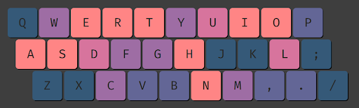

# Preface

## Issues with the Qwerty layout

The layout that comes installed by default with most computers is called [Qwerty](https://en.wikipedia.org/wiki/QWERTY). It is named after the six letters that are placed on the top left corner of the keyboard:

Qwerty is still used nowadays because it became the standard all the way back in the typewriter era. Having said that, Qwerty is a terrible layout, for many reasons:

- The most common letters (shown in orange) are scattered around the keyboard.
- Thousands of English words are typed with a single hand, while the other hand sits still (e.g. `afterwards`, `average,` `garbage,` `million,` `monopoly,` `opinion.`..).
- There are many words where a single finger types lots of letters (e.g. `December,` `science,` `decided,` `community,` `minimum,` `anonymous.`..).
- Similarly, numerous words are typed by alternating only two fingers for the most part (e.g. `return,` `thought,` `monthly,` `bought,` `amendment,` `Sydney,` `burn.`..).
- There are instances where one finger has to press two far away keys in a row, forcing that finger to make a big jump (bigrams like `ec,` `br,` `un,` `ny,` `um,` `my.`..).
- There are uncomfortable patterns where one finger goes down, but an adjacent finger goes up (e.g. the `cr` bigram, where the index presses `R` and the middle `C`).
- Finally, there are bigrams that require a lateral wrist motion (e.g. `eg` or `eb`).

## Programs used to install a new layout

- [**Msklc**](https://www.microsoft.com/en-us/download/details.aspx?id=102134): Default for windows
- [**Xkb**](https://www.x.org/wiki/XKB/): Default for linux
- [**Ukelele**](https://github.com/sillsdev/Ukelele): Default for mac
- [**Kmonad**](https://github.com/kmonad/kmonad): Runs on all three OS
- [**Kanata**](https://github.com/jtroo/kanata): Runs on all three OS. It is a rewrite of Kmonad with more features.
- [**Keyd**](https://github.com/rvaiya/keyd): A Kanata alternative for linux.
- [**Karabiner-Elements**](https://karabiner-elements.pqrs.org/): Has the most features on mac.
- [**Capsicain**](https://github.com/cajhin/capsicain): An option for windows that uses the interception driver.
- [**Autohotkey**](https://www.autohotkey.com/): A macro creation and automation software for windows. Unlike the previous ones, it is not a program for layouts specifically, but can be used for that.

The first three only require using the program once to install the layout. After that, the layout will always be loaded. For the other ones, the program needs to run each time we start our computer. Regardless, that can generally be setup so it happens automatically.
